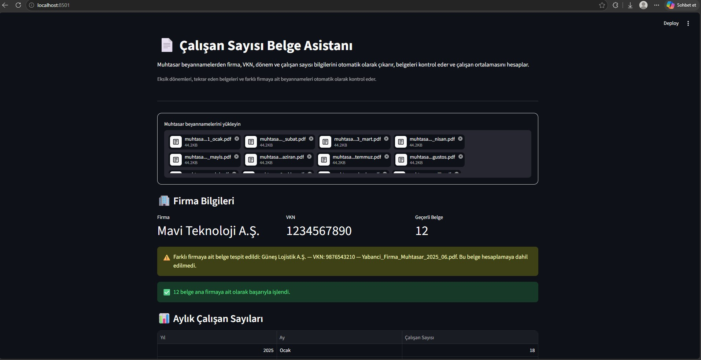
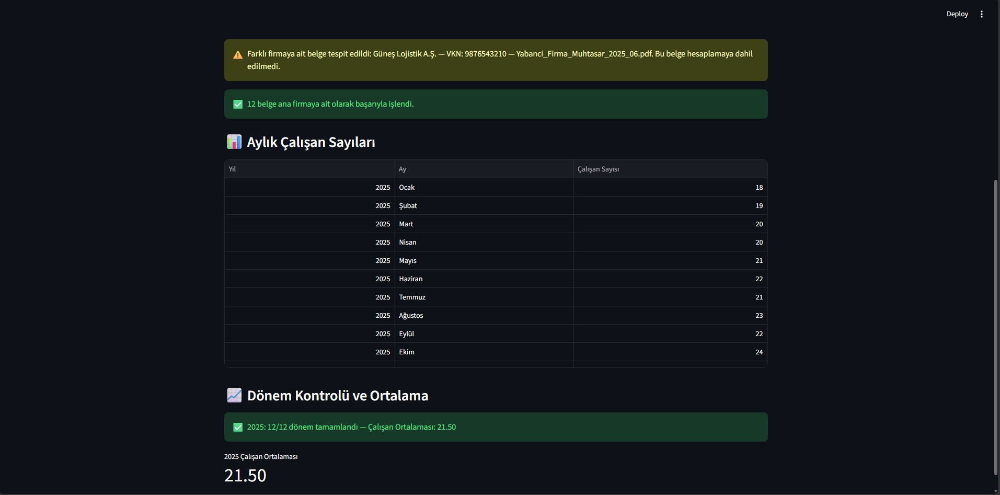
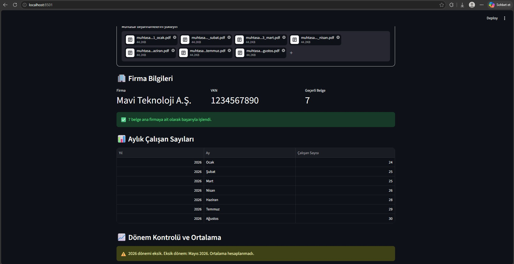

# 📄 Çalışan Sayısı Belge Asistanı

Muhtasar beyannamelerden çalışan sayısı bilgilerinin manuel olarak kontrol edilmesi ve dönemsel ortalamanın hesaplanması zaman alan bir süreç olabiliyor.
Bu projeyi, bu süreci daha hızlı ve kontrollü hale getirmek amacıyla geliştirdim.

## 🎯 Proje Ne Yapıyor?

Uygulamaya birden fazla muhtasar beyanname PDF'i yüklenebiliyor.
Sistem belgelerden otomatik olarak:
- Firma adını
- Vergi Kimlik Numarasını (VKN)
- Beyanname dönemini
- Çalışan sayısını
okuyor ve aylık çalışan sayılarını tablo halinde gösteriyor.
Dönem tamamlandığında çalışan sayısı ortalamasını otomatik olarak hesaplıyor.

## 🔍 Belge Kontrolleri

Uygulama yalnızca ortalama hesaplamakla kalmıyor, yüklenen belgeleri de kontrol ediyor.
- Eksik ay varsa tespit eder ve ortalama hesaplamaz.
- Aynı döneme ait tekrar eden belge varsa uyarı verir.
- Farklı VKN'ye sahip başka bir firmaya ait belge yüklenirse tespit eder.
- Farklı firmaya ait belgeyi hesaplamaya dahil etmez.
- Okunamayan belgeler için kullanıcıyı uyarır.

## 🛠️ Kullanılan Teknolojiler

- Python
- Streamlit
- PyMuPDF
- Pandas
- Regular Expressions (Regex)

## 💡 Örnek Senaryo

12 aylık muhtasar beyannameler sisteme yüklendiğinde uygulama dönemleri kontrol eder.
Tüm aylar mevcutsa çalışan ortalamasını hesaplar.
Örneğin: **12/12 dönem tamamlandı → Çalışan Ortalaması: 21.50**
Bir ay eksik olduğunda ise: **Mayıs 2026 eksik → Ortalama hesaplanmadı.**
Yüklenen belgeler arasında farklı bir firmaya ait belge bulunursa bu belge tespit edilir ve hesaplamaya dahil edilmez.

## 📸 Uygulama Görüntüleri

### Farklı Firma / VKN Kontrolü  

### Aylık Çalışan Sayıları ve Ortalama  

### Eksik Dönem Kontrolü 

